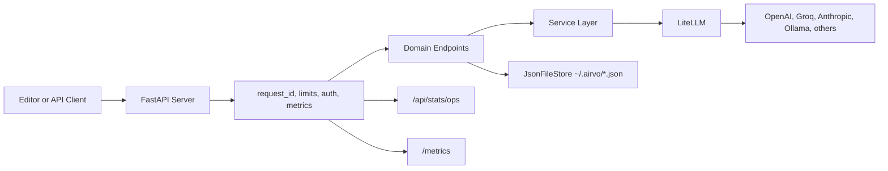

# Airvo Architecture (Versioned)

Version: 0.9.6
Audience: contributors and maintainers

## System Summary

Airvo is a local AI routing server with a web dashboard.

- API runtime: FastAPI + Uvicorn
- Model bridge: LiteLLM
- Frontend: React + Vite static bundle served by backend
- Local persistence: JSON files under ~/.airvo
- External observability: Prometheus metrics + optional OTLP tracing
- Governance: CI quality gates, security workflows, release/tag validation, SBOM

## High-Level Flow

## Backend Layering

- Composition only: airvo/api/routes.py
- Endpoint behavior: airvo/api/endpoints/
- Cross-cutting helpers: airvo/api/common/
- Shared orchestration: airvo/api/services/
- Persistence abstraction: airvo/storage/json_store.py
- App bootstrap and middleware: airvo/server.py

## Contracts

HTTP errors keep a stable envelope:
- detail
- error
- request_id

SSE errors keep a stable envelope:
- type=error
- error
- error_meta
- request_id

## Reliability and Security Controls

- Middleware rate limits and request-size protection
- Retry with exponential backoff and per-model circuit breaker
- Optional admin-token protection for sensitive mutations
- Structured logs with request correlation

## Observability

- Internal endpoint metrics: /api/stats/ops and /api/stats/ops/alerts
- External metrics: /metrics for Prometheus
- Optional distributed tracing with OTLP

## Release and Quality Gates

- CI checks: tests, dashboard build, optional load smoke
- Security checks: dependency review, static analysis, secret scanning
- Release governance: semver/tag validation and SBOM artifact

## Contributor Entry Points

- Start contribution process: CONTRIBUTING.md
- First-time setup flow: airvo/docs/CONTRIBUTOR_ONBOARDING.md
- 30-minute DX protocol: airvo/docs/DX_30MIN_CHECKLIST.md
